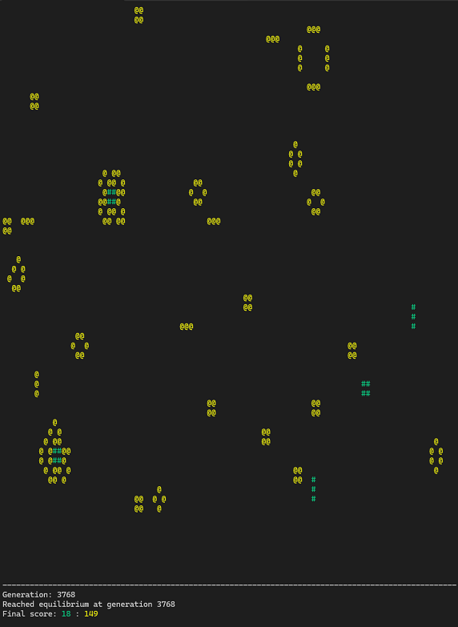

<h1 align="center">🌱 Game of Life</h1>

### Usage:
  > $ raku ./game-of-multi-life.raku [<\*.mid>/--no-midi] [--sleep sec] [<examples/\*.json>]

### Requirements:
  - [Install rakudo](https://rakudo.org/downloads)
  - zef install MIDI::Make --force-test
  - zef install JSON::Fast
  > #`< Zef is a package manager dedicated for Raku language >

### Documentation:

## Game-of-Life audification demos:
The arpeggios you can hear in the demos are taken from the program’s MIDI output and rendered in FL Studio at a very low BPM.

https://github.com/user-attachments/assets/b780f4e4-5dc2-4ee7-aac6-f4ea78996d87

https://github.com/user-attachments/assets/1a57e650-8388-4462-bd0a-5c50c011dd45

---

## Screenshots (single/multi-life mode):

  
  

